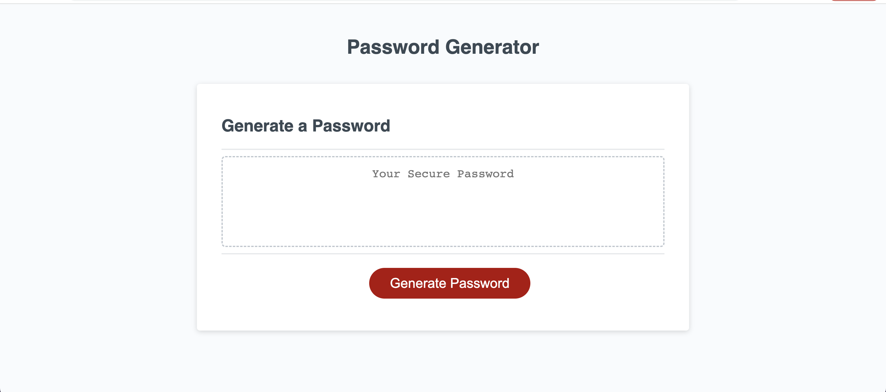

<h1>JavaScript Challenge: Password Generator</h1>
This project involves creating a random password generator application to help users generate secure passwords based on their selected criteria. The application runs in the browser and features a responsive, user-friendly interface with dynamically updated HTML and CSS powered by JavaScript.

<h2>Password Generator Screenshot<h2>

<h2>Features</h2>
Generate a random password based on user-selected criteria
Choose password length between 8 and 128 characters
Include options for lowercase, uppercase, numeric, and/or special characters
Input validation to ensure at least one character type is selected
Display the generated password in an alert or write it to the page
<h2>Installation</h2>
Clone the repository
bash
Copy code
git clone https://github.com/ndubuisiazi/JavaScript_Password_Generator.git
Open the index.html file in your preferred web browser.
Usage
Click the "Generate Password" button to start the password generation process.
Follow the prompts to select your desired password criteria.
After answering all the prompts, a random password will be generated and displayed.
Technologies Used
HTML
CSS
JavaScript
<h2>Acknowledgements</h2>
This project was completed as part of a web development course challenge. The primary goal was to create a random password generator application that provides users with secure passwords based on their selected criteria, using HTML, CSS, and JavaScript.
